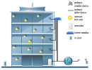

# Red de monitorización de CO2

Propuesta de proyecto Capstone 2021

Ideado por:

* Dr. Adán Geovanni Medrano Chávez
* Dra. Areli Rojo Hernández

## Resumen

Este documentos esboza las ideas generales que conllevarían al desarrollo de un sistema de monitorización de CO2 basado en una red de sensores. Los sensores estarían conectados mediante radios WiFi a una internet privada. El objetivo de este proyecto es proveer a la industria y al sector público un sistema que permita medir la calidad del aire dentro de espacios cerrados. Las mediciones que el sistema arroje permitirían generar alertas que informen que es necesario ventilar un área. El desarrollo de este proyecto es necesario porque actualmente se requieren sistemas que coadyuven con las medidas de prevención de infecciones respiratorias. El sistema que tenemos en mente permitiría detectar indirectamente posibles riesgos de contagio de la COVID-19 o la influenza. Esto debido a que una concentración de 600 PPM de CO2 indicarían que el área de monitorización no está suficientemente ventilada.

## Introducción

De acuerdo con estudios recientes (), la COVID-19 es una enfermedad cuyo patógeno se transmite via aerea a través de los aerosoles que expulsamos al hablar, estornudar o toser.

Con el fin de reducir el número de contagios de esta enfermedad, se han ideado diversas medidas de prevención. En México, por ejemplo, se fomenta el uso de cubrebocas y el control del aforo en lugares cerrados. Actualmente, diversos estudios sugieren que monitorizar la calidad del aire, junto con el siguimiento de las medidas anteriores, ayudaría significativamente en la reducción de contagios.

En el mercado existen diversos monitores de CO2 que permiten obtener indirectamente una medición de la calidad del aire, siendo el valor de 600 PPM un indicador que sugiere la ventilación del área de observación del dispositivo. 

Los de monitores son apropiados para su uso en espacios pequeños, como los cuartos de una casa o las oficinas de una microempresa, porque los usuarios pueden leer las mediciones que el aparato muestra en su pantalla. No obstante, la monitorización de un área grande, como un campus universitario, un centro comercial o las oficinas de un corporativo, mediante monitores de CO2 comerciales no sería suficiente debido a que se requiere ir al lugar de colocación del monitor para conocer se lectura.

Una red de sensores de CO2 resulta más apropiada para monitorizar grandes espacios porque este sistema permitiría que sus usuarios obtengan información sobre la calidad del aire de manera remota mediante una aplicación web; así, los visitante podrían conocer la calidad del aire, previo a sus llegada. Además, los datos colectados por el sistema permitiría a los administradores del área tomar medidas más acertadas sobre el aforo, también podrían dirigir el flujo de personas a áreas ventiladas o impedir el paso en zonas donde la calidad del aire no es la apropiada. Inclusive, los datos capturados por la red de sensores podrían utilizarse para correlacionar los reportes de contagios con las áreas con ventilación inapropiada.

La situación de emergencia sanitaria que se experimenta actualmente requiere de sistemas que coadyuven con las medidas de prevención de infecciones respiratorias: la red de sensores que describiremos en esta propuesta de proyecto justo busca ser parte de los complementos que ayuden a mitigar los problemas relacionados con la pandemia.

## Problema

*A partir de una red de sensores de CO2, monitorizar remotamente la calidad del aire de los espacios de una área geográfica limitada*.

## Objetivos

Habremos logrado solucionar el problema anterior una vez que el siguiente objetivo sea alcanzado.

### Objetivo general

Diseñar e implementar una red de sensores que capture mediciones de CO2 provenientes de un área geográfica limitada. Las mediciones serán recolectadas por un agente (*broker*). Los sensores estarían energizados mediante la red eléctrica, asimismo, estos dispositivos estarán conectados a una internet privada via WiFi, al igual que el agente. El agente tendría conexión con la Internet pública para que los usuarios puedan acceder remotamente a las mediciones obtenidas por la red de sensores; esto mediante una aplicación web. La realización del proyecto debe producir una red integrada por 10 sensores, el software de programación de un agente y una aplicación web que muestre información sobre el escenario de monitorización. Estos productos deben estar finalizados en un plazo de seis meses, justo dos semanas antes de ser presentados en la Samsung Campus Party 2022. 

### Objetivos específicos

El objetivo general se alcanzará gradualmente, mediante el cumplimiento de los siguientes objetivos específicos.

1. Diseñar e implementar un sensor remoto de CO2.
2. Diseñar e implementar un agente que procese los datos de los sensores remotos.
3. Diseñar e implementar una aplicación web que muestre los datos procesados por el agente.
4. Analizar la interacción entre los sensores, el agente y la aplicación web.
5. Diseñar una arquitectura de red que permita conectar los sensores remotos en en diferentes subredes.
6. Configurar una internet privada según la arquitectura de red del objetivo cinco.
7. Conectar la red de sensores, el agente y la aplicación web sobre la internet privada.
8. Verificar la interacción del sistema de monitorización sobre la internet privada.
9. Configurar la aplicación web para que pueda ser accedida mediante la Internet pública.
10. Verificar que el sistema de monitorización opera correctamente.

## Justificación

La realización de este proyecto requiere del uso de las tecnologías de la Internet de las Cosas porque su principal función es la monitorización de los niveles de CO2 en un área cuya extensión haría que el uso de monitores convencionales sea infactible.

Los datos que el sistema capture serán procesados y presentados de tal manera que sea sencillo tomar decisiones sobre qué áreas ventilar y cuándo hacerlo. Asimismo, los visitantes del área de observación podrían decidir si visitar o no uno los lugares específicos a los que se dirigen sin la necesidad de estar ahí presentes.

El sistema de monitorización sería diseñado para que el software del agente, la aplicación web y los sensores remotos puedan ser actualizados.Asimismo, sería necesario dar mantenimiento preventivo y correctivo a los sensores remotos para asegurar que estos están operando correctamente. Estas dos necesidades permitirían seguir obteniendo capital después de que la venta de la red de sensores.

## Descripción del escenario de aplicación

## Materiales requeridos

### Software

1. Editor de código fuente VS Code.
2. Terminal de comandos.
3. Extensiones de VS Code para programar en C/C++, Arduino C, Java, Python y Markdown.
4. Compiladores GCC o CLANG.
5. Kit de desarrollo de Java AdoptOpenJDK o JavaJDK.
6. Interpreté Python 3.9.
7. Entorno de desarrollo integrado de Arduino.
8. Extensiones para trabajar con placas Arduino y ESP.
9. Editor de programas basados en flujos Node-Red.
10. Simulador de redes CISCO Packet Tracer (tentativo).
11. Simulador de redes OMNeT++ (tentativo).

### Hardware

1. Placa de desarrollo ESP32.
2. Sensor de CO2.
3. Elementos electrónicos (alambres, resistores, capacitores, ledes, tabletas de desarrollo, etc.).

## Referencias
